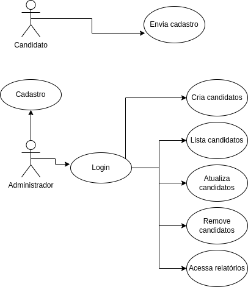

# Teste de contratação - Worc

Este projeto faz parte do teste de contratação da Worc. Desafio com foco em um
grupo muito importante: os candidatos! 
Os candidatos desse teste possuem os seguintes atributos:

- Nome
- Email
- CPF
- Idade
- Pretensão Salarial
- Disponibilidade imediata para trabalho

As regras de negocio que devem ser aplicadas são:
- Candidatos devem ter mais que 18 anos para finalizar o cadastro
- Email e CPF devem ser únicos
- Não possível alterar o CPF
- Paginados com limite de 5 por vez na listagem de candidatos
- Possibilidade de filtro por algum ou todos atributos do candidato

A aplicação foi hospedada no heroku e pode ser acessada neste <a href="https://worc-test-marcos.herokuapp.com/">link</a>

# Fluxo da API

Para este teste, tomei a liberdade de separar os usuários da API em dois tipos, os candidatos e os Administradores da Worc.
Os candidatos possuem uma única ação, enviar sua candidatura na plataforma. Os Administradores possuem mais funcionalidades atreladas, conseguem criar, editar, excluir, listar e filtrar as candidaturas.
Além disso, adicionei mais duas funcionalidades, relátorios que mostram os candidados com maior e menor pretensão salarial e os  candidados com maior e menor idade. O fluxo pode ser ilustrado no diagrama abaixo:

<center>

</center>

# Estrutura do projeto

Criei um diretorio chamado apps dentro do projeto para agregar todas as apps necessárias, por mais que seja um projeto 
pequeno, criei 3 apps para esse teste: accounts, candidates e reports Escolhi separar desta forma para separar as responsabilidades da aplicação. Cada app tem sua propria responsabilidade e funções.
Na raiz do projeto há dois diretorios muito importantes para esse teste, logs e tests. No diretorio logs armazeno todos os logs da aplicação, nos niveis de DEBUG, ERROR, FATAL, INFO e WARNING. O diretorio tests contem toda a cobertura de tests da aplicação.

# Documentação da API
### O sistema de atenticação adotado foi o JWT, onde na rota de login é retornado um token de acesso que deve ser usado como Bearer. Caso teste pelo swagger, clique em Autorize e no campo da api Key informe neste formato: 
```
Bearer <apiKey>
```

#### Cadastro do usuário Admin

```http
  POST /api/auth/register/admin/
```
body:
```
    {
        "first_name": "Marcos",
        "last_name": "Paulo",
        "email": "marcosbrasd@gmail.com",
        "username":"marcos",
        "password":"556@63712",
        "password2":"556@63712"
    }
```


#### Login do usuário Admin

```http
  POST /api/auth/login/
```
body:
```
    {
        "email": "marcosbrasd@gmail.com",
        "username":"marcos",
        "password":"556@63712"
    }
```

#### Envia cadastro do candidato

```http
  POST /api/candidates/register/
```
body:
```
    {
        "name": "Marcos Paulo",
        "email": "marcosbra@gmail.com",
        "age": 18,
        "salary_claim": 12.500,
        "cpf":"04846175324",
        "immediate_availability": true
    }
```


#### Cria cadastro do candidato - Admin
##### Precisa estar autenticado

```http
  POST /api/candidates/manager/
```
body:
```
    {
        "name": "Marcos Paulo",
        "email": "marcosbra@gmail.com",
        "age": 18,
        "salary_claim": 12.500,
        "cpf":"04846175324",
        "immediate_availability": true
    }

```

#### Edita cadastro do candidato - Admin
##### Precisa estar autenticado

```http
  PUT /api/candidates/manager/
```
body:
```
    {
        "name": "Marcos",
        "email": "mpbra@gmail.com",
        "age": 18,
        "salary_claim": 12.500,
        "immediate_availability": true
    }

```

#### Lista um candidato especifico - Admin
##### Precisa estar autenticado

```http
  GET /api/candidates/manager/

```

#### Lista todos os candidatos - Admin
##### Precisa estar autenticado

```http
  GET /api/candidates/manager/<int:pk>/
```

#### Remove um candidato - Admin
##### Precisa estar autenticado

```http
  DEL /api/candidates/manager/<int:pk>/
```

#### Relatorio do candidato mais novo VS mais velho - Admin
##### Precisa estar autenticado

```http
  GET /api/reports/candidates/age/
```

#### Relatorio maior pretensão salarial VS menor pretensão - Admin
##### Precisa estar autenticado

```http
  GET /api/reports/candidates/salary/
```

# Rodando o projeto
Para rodar o projeto localmente, entre no diretório do projeto e rode o comando:

```
    docker-compose up
```

Para rodar os testes execute:

```
    docker-compose run web ./manage.py test
```

Para facilitar os testes, exportei meu ambiente do Insomnia, é um app semelhante ao postman, utilizado para fazer requisições em API. O arquivo que esta na raiz do projeto, <a href="Insomnia_2021-12-29.json">Insomnia_2021-12-29.json</a>, pode ser importado diretamente na ferramenta. O Insomnia pode ser baixado neste <a href="https://insomnia.rest/download">link</a>
# Stack utilizada

**Back-end:** Python, Django, SQLITE, Docker, Heroku

